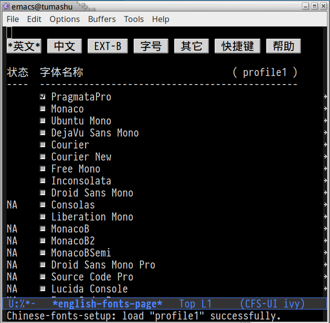
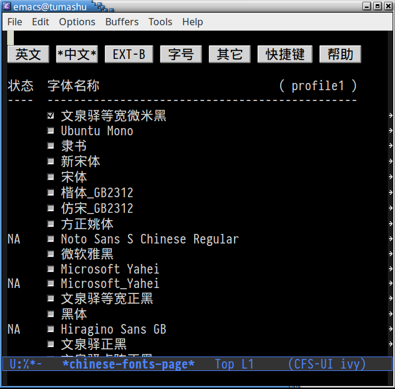
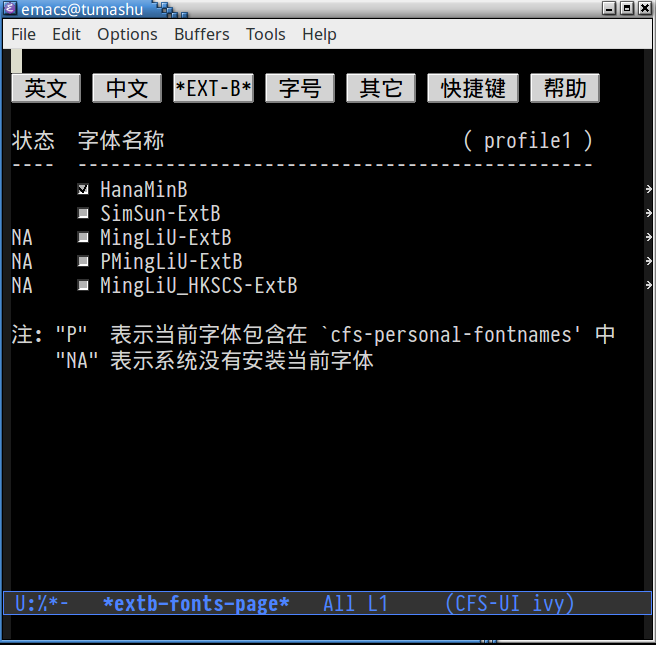
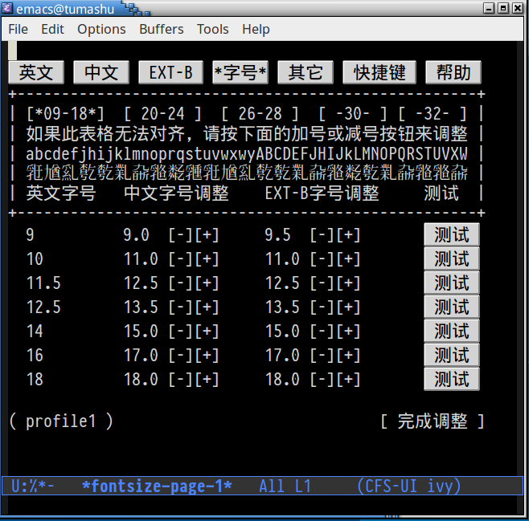
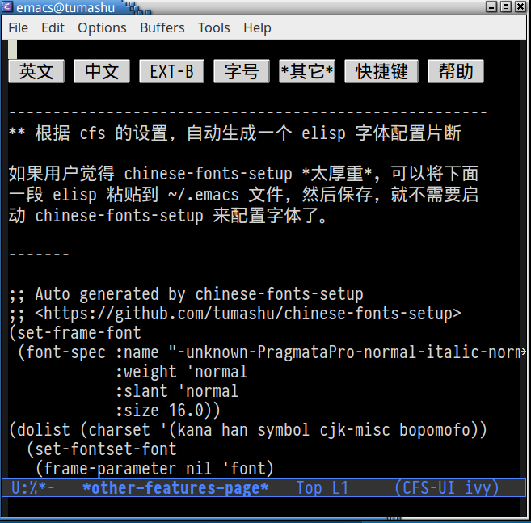
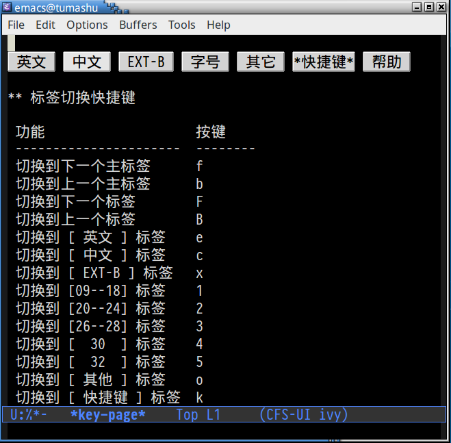

- [Chinese-fonts-setup README](#chinese-fonts-setup-readme)
  - [简介](#简介)
  - [基本原理](#基本原理)
  - [使用特点](#使用特点)
  - [下载安装](#下载安装)
  - [配置使用](#配置使用)
    - [最简单的用法（懒人必备）](#最简单的用法（懒人必备）)
    - [profile 的概念](#profile-的概念)
    - [profile 命名与切换](#profile-命名与切换)
    - [使用 cfs-edit-profile 命令调整 profile](#使用-cfs-edit-profile-命令调整-profile)
    - [使用 cfs-edit-profile-without-ui 命令编辑 profile](#使用-cfs-edit-profile-without-ui-命令编辑-profile)
    - [使用 cfs-regenerate-profile 重置 profile](#使用-cfs-regenerate-profile-重置-profile)
    - [调整字体大小](#调整字体大小)
    - [使用 cfs-use-system-type](#使用-cfs-use-system-type)
    - [让 chinese-fonts-setup 随着 emacs 自动启动](#让-chinese-fonts-setup-随着-emacs-自动启动)
    - [chinese-fonts-setup 与 org-mode 配合使用](#chinese-fonts-setup-与-org-mode-配合使用)
    - [使用 chinese-fonts-setup 生成 elisp 字体配置片断](#使用-chinese-fonts-setup-生成-elisp-字体配置片断)
    - [Chinese-fonts-setup 高级功能](#chinese-fonts-setup-高级功能)
  - [Tips](#tips)
  - [参考文章](#参考文章)

# Chinese-fonts-setup README

## 简介

Chinese-fonts-setup 是一个 emacs 中英文字体配置工具。可以比较方便地实现中文字体和英文字体等宽（也就是大家常说的中英文对齐）。

注： 这个 package 特别适用于需要处理中英文混合表格的中文 org-mode 用户。

## 基本原理

Chinese-fonts-setup 的核心很简单，就是让中文字体和英文字体使用不同的字号，从而实现中英文对齐，它和下面的样例代码原理是一样的：

    (set-frame-font "-unknown-PragmataPro-normal-normal-normal-*-*-*-*-*-*-0-iso10646-1")
    (dolist (charset '(kana han symbol cjk-misc bopomofo))
      (set-fontset-font (frame-parameter nil 'font)
                        charset (font-spec :family "Microsoft Yahei" :size 16)))

## 使用特点

Chinese-fonts-setup 添加了许多辅助工具，使配置和调节字体和字号的工作更加简便快捷，它有几个优点：

1.  安装即用：Chinese-fonts-setup 内置字体 fallback 功能，只需安装，就能够配置中文字体和英文字体，让中文可以 **正确** 显示（但未必完美），不会因为 emacs 配置中指定的字体不存在而报错。
2.  设置方便：Chinese-fonts-setup 自带一个 profile 文件调整工具，这个工具有直观的图形界面，可以让用户设置字体名称和字体大小，分分钟实现中文字体和英文字体的等宽对齐。

## 下载安装

1.  配置melpa源，参考：<http://melpa.org/#/getting-started>
2.  M-x package-install RET chinese-fonts-setup RET
3.  在emacs配置文件中（比如: ~/.emacs）添加如下代码：

        (require 'chinese-fonts-setup)
        ;; 让 chinese-fonts-setup 随着 emacs 自动生效。
        ;; (chinese-fonts-setup-enable)
        ;; 让 spacemacs mode-line 中的 Unicode 图标正确显示。
        ;; (cfs-set-spacemacs-fallback-fonts)

## 配置使用

### 最简单的用法（懒人必备）

通过下面几个命令，用户可以 **快速** 了解 chinese-fonts-setup 的大部分功能，而不需要阅读整篇文档，如果用户想深入了解 chinese-fonts-setup 或者自定义一些特殊的功能，阅读整篇文档是逃不开的。

<table border="2" cellspacing="0" cellpadding="6" rules="groups" frame="hsides">

<colgroup>
<col  class="org-left" />

<col  class="org-left" />
</colgroup>
<thead>
<tr>
<th scope="col" class="org-left">命令</th>
<th scope="col" class="org-left">功能</th>
</tr>
</thead>

<tbody>
<tr>
<td class="org-left">cfs-edit-profile</td>
<td class="org-left">调整字体设置</td>
</tr>

<tr>
<td class="org-left">cfs-increase-fontsize</td>
<td class="org-left">增大字号</td>
</tr>

<tr>
<td class="org-left">cfs-decrease-fontsize</td>
<td class="org-left">减小字号</td>
</tr>
</tbody>
</table>

### profile 的概念

profile 代表了一套字体配置，chinese-fonts-setup 使用 profile 的概念，来维护多套字体配置，从而实现特定的环境使用特定的字体配置，比如：在编程时使用 “Consolas + 微米黑”，在阅读文章时使用 “PragmataPro + 黑体”，等等。

每一个 profile 都对应一个 emacs-lisp 文件, 保存在 \`cfs-profiles-directory'
目录中, 这些文件包含了英文字体设置，中文字体设置以及中文字体大小，其结构类似：

    (setq cfs--custom-set-fontnames
          '(("PragmataPro" "Ubuntu Mono" "DejaVu Sans Mono")
            ("文泉驿等宽微米黑" "Ubuntu Mono" "隶书" "新宋体")
            ("HanaMinB" "SimSun-ExtB" "MingLiU-ExtB")))

    (setq cfs--custom-set-fontsizes
          '((9    9.0  9.5 )
            (10   11.0 11.0)
            (11.5 12.5 12.5)
            (12.5 13.5 13.5)
            (14   15.0 15.0)
            (16   17.0 17.0)
            (18   18.0 18.0)
            (20   21.0 21.0)
            (22   23.0 23.0)
            (24   25.5 25.5)
            (26   27.0 27.0)
            (28   29.0 29.0)
            (30   32.0 32.0)
            (32   33.0 33.0)))

### profile 命名与切换

Chinese-fonts-setup 默认使用三个 profile: profile1, profile2 和
profile3, 如果想使用其它有意义的名称，可以设置:

    (setq cfs-profiles
        '("program" "org-mode" "read-book"))

chinese-fonts-setup 使用下面两个命令来切换 profile ：

<table border="2" cellspacing="0" cellpadding="6" rules="groups" frame="hsides">

<colgroup>
<col  class="org-left" />

<col  class="org-left" />
</colgroup>
<thead>
<tr>
<th scope="col" class="org-left">Command</th>
<th scope="col" class="org-left">Help</th>
</tr>
</thead>

<tbody>
<tr>
<td class="org-left">cfs-switch-profile</td>
<td class="org-left">选择并切换 profile</td>
</tr>

<tr>
<td class="org-left">cfs-next-profile</td>
<td class="org-left">直接切换到下一个profile</td>
</tr>
</tbody>
</table>

### 使用 cfs-edit-profile 命令调整 profile

如果 **当前使用** 的字体不符合使用习惯，用户可以运行 \`cfs-edit-profile'
命令来调整 **当前** profile,这个命令会弹出一个图形化界面，类似：

### 使用 cfs-edit-profile-without-ui 命令编辑 profile

除了使用 \`cfs-edit-profile' , **有经验** 的用户也可以使用
\`cfs-edit-profile-without-ui' 命令，直接编辑当前 profile 文件，两个命令的效果是一样的。

在编辑的过程中，用户可以使用下面三个命令 **快速** 的测试编辑效果：

<table border="2" cellspacing="0" cellpadding="6" rules="groups" frame="hsides">

<colgroup>
<col  class="org-left" />

<col  class="org-left" />

<col  class="org-left" />
</colgroup>
<thead>
<tr>
<th scope="col" class="org-left">Key</th>
<th scope="col" class="org-left">Command</th>
<th scope="col" class="org-left">Help</th>
</tr>
</thead>

<tbody>
<tr>
<td class="org-left">C-c C-c</td>
<td class="org-left">cfs-test-fontsizes-at-point</td>
<td class="org-left">查看字体显示效果</td>
</tr>

<tr>
<td class="org-left">C-up</td>
<td class="org-left">cfs-increment-fontsize-at-point</td>
<td class="org-left">增大光标下字号的大小，同时显示对齐效果</td>
</tr>

<tr>
<td class="org-left">C-down</td>
<td class="org-left">cfs-decrement-fontsize-at-point</td>
<td class="org-left">减小光标下字号的大小，同时显示对齐效果</td>
</tr>
</tbody>
</table>

注1: 不建议 chinese-fonts-setup 新用户使用这种方式

注2: 配置完成后，有可能需要重启 Emacs, 参考：<http://debbugs.gnu.org/db/17/1785.html>

### 使用 cfs-regenerate-profile 重置 profile

\`cfs-regenerate-profile' 命令会使用 chinese-fonts-setup 自带的
fallback 信息，覆盖需要 **重置** 的 profile, 这个 profile 原来的内容将丢失，请紧慎使用！

### 调整字体大小

\`chinese-fonts-setup' 使用下述两个命令调整字体大小:

<table border="2" cellspacing="0" cellpadding="6" rules="groups" frame="hsides">

<colgroup>
<col  class="org-left" />

<col  class="org-left" />
</colgroup>
<thead>
<tr>
<th scope="col" class="org-left">Command</th>
<th scope="col" class="org-left">Help</th>
</tr>
</thead>

<tbody>
<tr>
<td class="org-left">cfs-increase-fontsize</td>
<td class="org-left">增大字体大小</td>
</tr>

<tr>
<td class="org-left">cfs-decrease-fontsize</td>
<td class="org-left">减小字体大小</td>
</tr>
</tbody>
</table>

注意：在调整字体大小的同时，字号信息也会保存 ~/.emacs 中。

### 使用 cfs-use-system-type

有些用户希望将 profile 配置文件做为自己的 emacs 配置，在不同的计算机上同步和管理，我建议这些用户将 \`cfs-use-system-type'
设置为 t, 这样，相同名称的 profile 在不同的操作系统下，保存的位置也不同，可以避免 profile 冲突。

### 让 chinese-fonts-setup 随着 emacs 自动启动

\`chinese-fonts-setup-enable' 命令可以让 chinese-fonts-setup 随着
emacs 自动启动，这个命令将 \`cfs-set-font-with-saved-step' 添加到下面两个 hook:

1.  \`after-make-frame-functions'
2.  \`window-setup-hook'

用户也可以手动运行 \`cfs-set-font-with-saved-step' 来让
chinese-fonts-setup 生效。

### chinese-fonts-setup 与 org-mode 配合使用

许多用户使用 org-mode 时，习惯让不同的标题，使用的字体大小也不同，这个特性需要用户设置：

    (setq cfs-use-face-font-rescale t)

注：这个功能不能在 window 系统下使用，它会让对齐功能失效，Linux 下这个功能 **一般** 可以使用，Mac 系统未测试，同学可以亲自试一试。

### 使用 chinese-fonts-setup 生成 elisp 字体配置片断

有些用户觉得 chinese-fonts-setup **太过厚重** , 他们喜欢使用简单的方式来配置字体，这些用户可以了解一下 \`cfs-insert-fonts-configure'
命令，这个命令可以根据 chinese-fonts-setup 的设置自动生成一个
"字体配置 elisp 片断", 并插入光标处，将这个片断写入 .emacs 文件后，就不需要启动 chinese-fonts-setup 来设置字体了。

### Chinese-fonts-setup 高级功能

Chinese-fonts-setup **仅仅** 设置英文，中文和 EXT-B 字体，不处理其它字符的字体，比如：symbol 字符，但 chinese-fonts-setup 可以通过 hook: \`cfs-set-font-finish-hook' 来处理类似的问题（这个
hook 使用的函数只有一个参数 fontsizes-list, 用来记录 **当前使用**
的英文字体，中文字体和 EXT-B 字体的字号）。

下面是一些例子：

1.  设置 symbol 字符的字体

        (defun my-set-symbol-fonts (fontsizes-list)
          (let* ((fontname "Inconsolata")
                 (fontsize (nth 0 fontsizes-list))
                 (fontspec (font-spec :name fontname
                                      :size fontsize
                                      :weight 'normal
                                      :slant 'normal)))
            (if (cfs--fontspec-valid-p fontspec)
                (set-fontset-font "fontset-default" 'symbol fontspec nil 'append)
              (message "字体 %S 不存在！" fontname))))

        (add-hook 'cfs-set-font-finish-hook 'my-set-symbol-fonts)

2.  设置一些不常用汉字字符的字体

        (defun my-set-exta-fonts (fontsizes-list)
          (let* ((fontname "微软雅黑")
                 (fontsize (nth 1 fontsizes-list))
                 (fontspec (font-spec :name fontname
                                      :size fontsize
                                      :weight 'normal
                                      :slant 'normal)))
            (if (cfs--fontspec-valid-p fontspec)
                (set-fontset-font "fontset-default" '(#x3400 . #x4DFF) fontspec nil 'append)
              (message "字体 %S 不存在！" fontname))))

        (add-hook 'cfs-set-font-finish-hook 'my-set-exta-fonts)

    注意事项：

    1.  "(#x3400 . #x4DFF)" 代表了待设字符在 unicode-bmp 中的范围。
    2.  用户可以通过下面的方式来确定待字符的范围
        1.  运行 \`describe-char' 来显示 **待设字符** 的信息
        2.  点击 “code point in charset” 处的链接，来显示整个 unicode-bmp 表
        3.  获取范围

3.  设置行距随着字号自动调整

        (defvar my-line-spacing-alist
              '((9 . 0.1) (10 . 0.9) (11.5 . 0.2)
                (12.5 . 0.2) (14 . 0.2) (16 . 0.2)
                (18 . 0.2) (20 . 1.0) (22 . 0.2)
                (24 . 0.2) (26 . 0.2) (28 . 0.2)
                (30 . 0.2) (32 . 0.2)))

        (defun my-line-spacing-setup (fontsizes-list)
          (let ((fontsize (car fontsizes-list))
                (line-spacing-alist (copy-list my-line-spacing-alist)))
            (dolist (list line-spacing-alist)
              (when (= fontsize (car list))
                (setq line-spacing-alist nil)
                (setq-default line-spacing (cdr list))))))

        (add-hook 'cfs-set-font-finish-hook #'my-line-spacing-setup)

## Tips

1.  如果用户需要在自己的 emacs 配置中管理一些个人字体，可以使用变量
    \`cfs-personal-fontnames' , 其结构与 \`cfs&#x2013;fontnames-fallback'一样。
2.  使用命令: \`describe-char' 可以了解光标处字符使用什么字体。
3.  在 scratch 中写一行 elisp 代码：

        (cl-prettyprint (font-family-list))

    执行后，就会在 scratch 中插入当前可用字体的名称列表，这是一个很有用的技巧。
4.  命令：\`cfs-insert-fontname', 可以让用户选择一个可用字体插入到当前光标处。
5.  Windows 用户 (特别是 Windows XP 用户) 可以安装 MacType 软件来优化字体显示效果，推荐使用。
6.  Mac 用户配置 profile 文件的时候，偶尔会遇到 'C-c C-c' 刷新缓慢的问题，这可能是 ext-b 字体缺失引起的，建议安装 ext-b 字体试试。
    1.  Ext-B字符列表: <https://cdo.wikipedia.org/wiki/Wikipedia:Unicode%E6%93%B4%E5%B1%95%E6%BC%A2%E5%AD%97>
    2.  HanaMinB 下载地址: <https://osdn.jp/projects/hanazono-font/downloads/62072/hanazono-20141012.zip/>
7.  字体设置和 coding 设置也有关系，如果 chinese-fonts-setup 的行为很奇怪，又找不到确切原因，可以参考：<https://github.com/tumashu/chinese-fonts-setup/issues/54#issuecomment-246228904>

## 参考文章

1.  <http://baohaojun.github.io/perfect-emacs-chinese-font.html>
2.  <http://zhuoqiang.me/torture-emacs.html>
